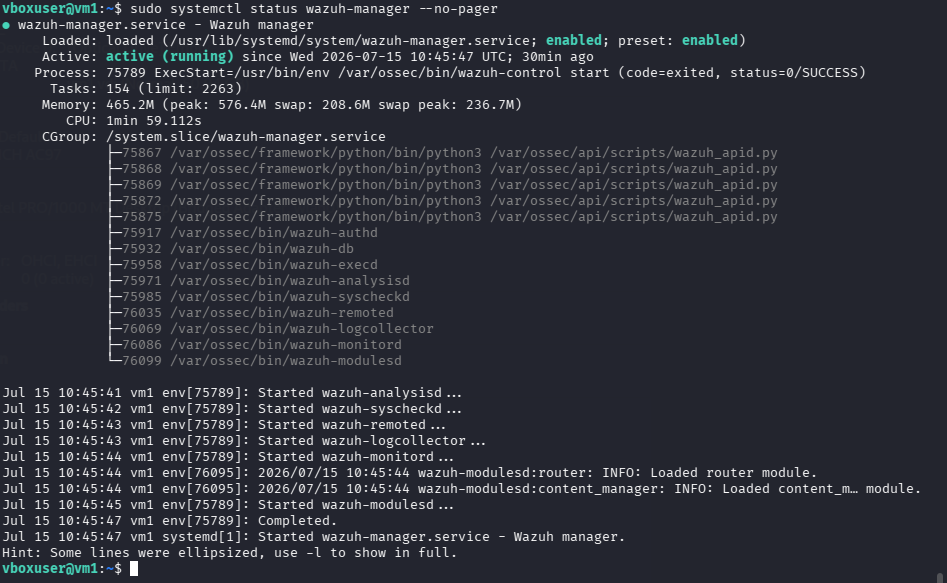
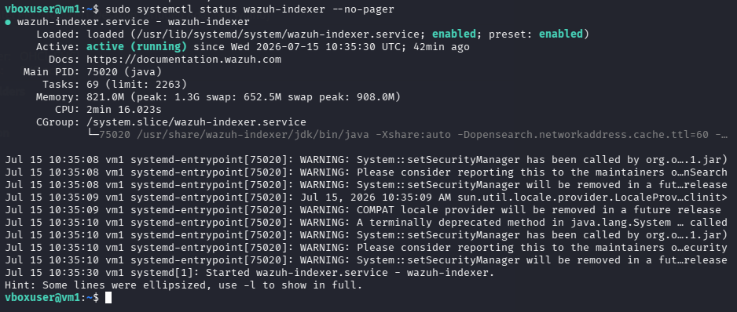
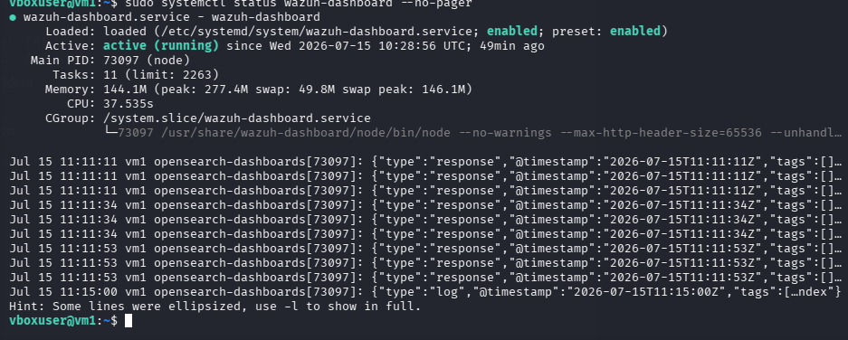
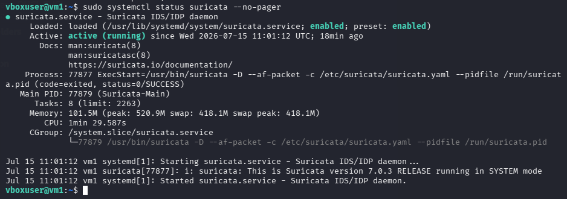
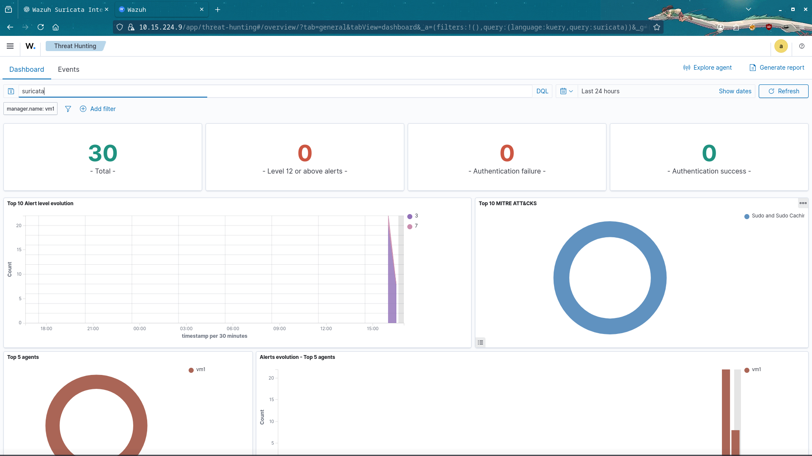
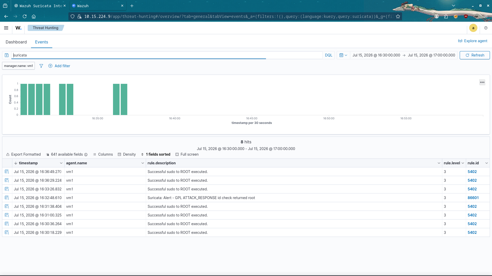
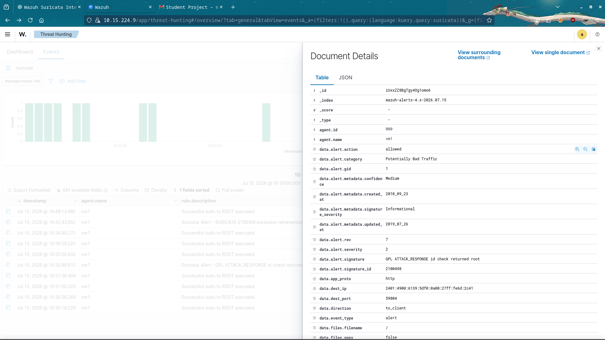

# Wazuh SIEM with Suricata IDS Integration

## Overview

This project demonstrates the deployment and integration of **Wazuh SIEM** with **Suricata IDS** on **Ubuntu Server 24.04 LTS**. The objective was to build a centralized security monitoring solution capable of detecting, collecting, and analyzing network intrusion events in real time.

Suricata monitors network traffic and generates alerts based on the **ET/Open** rule set. These alerts are written to the **EVE JSON** log file, which is monitored by **Wazuh Logcollector**. Wazuh processes the events and displays them through the **Threat Hunting Dashboard** for analysis.

---

## Features

- Deployed Wazuh Manager, Indexer, and Dashboard
- Installed and configured Suricata IDS
- Enabled Emerging Threats Open (ET/Open) rules
- Integrated Suricata EVE JSON logs with Wazuh
- Real-time security event monitoring
- Threat Hunting dashboard visualization
- End-to-end IDS alert validation

---

## Technologies Used

- Ubuntu Server 24.04 LTS
- Wazuh SIEM
- Suricata IDS
- Oracle VirtualBox
- Linux
- ET/Open Rules
- JSON Log Collection

---

## Architecture

```
                Network Traffic
                      │
                      ▼
               Suricata IDS
                      │
       /var/log/suricata/eve.json
                      │
            Wazuh Logcollector
                      │
               Wazuh Manager
                      │
               Wazuh Indexer
                      │
             Wazuh Dashboard
                      │
              Threat Hunting
```

---

## Installation

### Install Wazuh

```bash
curl -sO https://packages.wazuh.com/4.12/wazuh-install.sh
sudo bash wazuh-install.sh -a -i
```

### Install Suricata

```bash
sudo apt update
sudo apt install suricata suricata-update -y
```

### Enable ET/Open Rules

```bash
sudo suricata-update enable-source et/open
sudo suricata-update
sudo systemctl restart suricata
```

---

## Testing

To verify the integration, a test IDS alert was generated using:

```bash
curl http://testmyids.com
```

The generated alert was detected by Suricata and successfully forwarded to Wazuh, where it appeared in the **Threat Hunting Dashboard**.

---

# Screenshots

## Ubuntu Server


---

## Wazuh Manager Status



---

## Wazuh Indexer Status



---

## Wazuh Dashboard Status



---

## Suricata Status



---

## Threat Hunting Dashboard



---

## Suricata Events



---

## Alert Details



---

# Project Outcome

This project successfully demonstrated the integration of **Wazuh SIEM** with **Suricata IDS** for centralized security monitoring. Network intrusion alerts generated by Suricata were collected, analyzed, and visualized through the Wazuh Dashboard, providing real-time visibility into security events.

The implementation strengthened practical knowledge of:

- SIEM Deployment
- Intrusion Detection Systems (IDS)
- Linux Administration
- Security Monitoring
- Threat Hunting
- Log Analysis
- Security Operations Center (SOC) Concepts

---

## Author

**Adwaidh R**

- LinkedIn: https://www.linkedin.com/in/adwaidh-r-8a9027358
- GitHub: https://github.com/AdwaidhR
